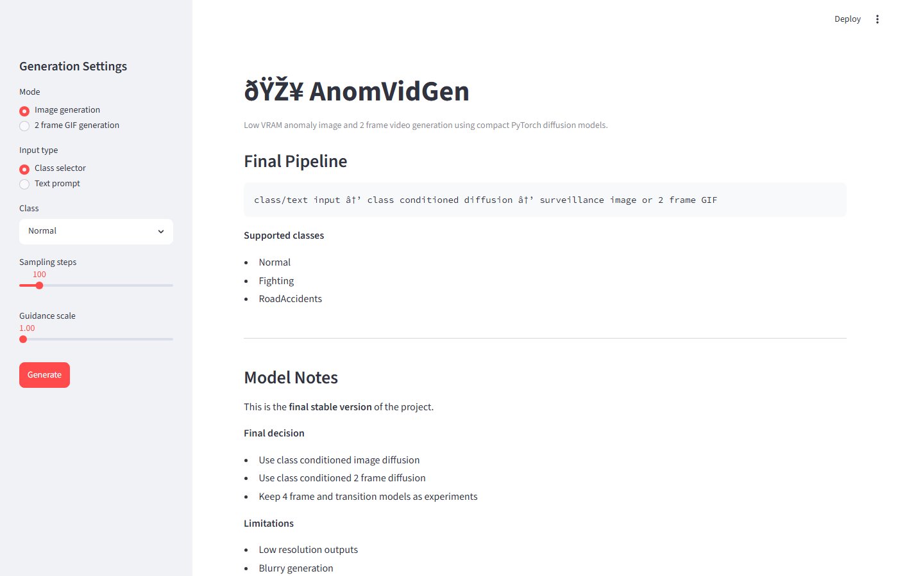
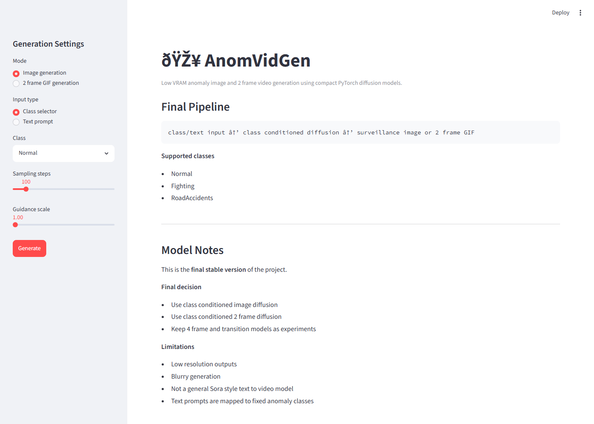
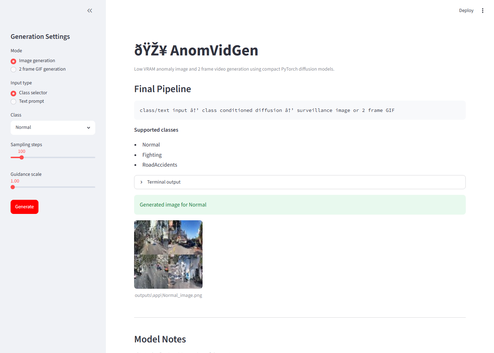
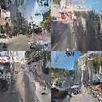
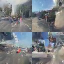
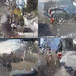

# AnomVidGen

Low VRAM anomaly **image** and **2-frame GIF** generation using compact class-conditioned PyTorch diffusion models.

Train on surveillance-style anomaly classes — **Normal**, **Fighting**, and **RoadAccidents** — then generate new samples from the Streamlit app or CLI.



---

## What it does

| Mode | Output | Model |
|------|--------|-------|
| Image generation | 64×64 surveillance-style still (4-sample grid) | `runs/image2d_class/latest.pt` |
| 2-frame GIF | Animated 2-frame loop + side-by-side preview | `runs/video2f_class/latest.pt` |

**Pipeline:** `class or text prompt → keyword mapping → class-conditioned diffusion → image or GIF`

Text prompts are **not** open-ended text-to-video. Keywords like `fight`, `crash`, or `road` map to one of the three fixed classes.

---

## Quick start (run the app)

### 1. Install dependencies

```powershell
cd TinyVideoDiffusinModel
python -m venv .venv
.\.venv\Scripts\Activate.ps1
pip install -r requirements.txt
```

### 2. Verify checkpoints exist

The app expects trained weights at:

```
runs/image2d_class/latest.pt
runs/video2f_class/latest.pt
```

If missing, train first (see [Training](#training) below).

### 3. Launch Streamlit

```powershell
streamlit run app.py
```

Open **http://localhost:8501** in your browser.

---

## App walkthrough (with screenshots)

### Step 1 — Choose settings in the sidebar

- **Mode:** Image generation or 2-frame GIF generation
- **Input:** Class selector or text prompt (keyword-mapped)
- **Class:** Normal / Fighting / RoadAccidents
- **Sampling steps:** 50–500 (default 100)
- **Guidance scale:** 1.0–3.0 (default 1.0)



### Step 2 — Click **Generate**

The app calls the sampling scripts and shows the result inline.

**Image mode** saves to `outputs/app/{Class}_image.png`:



**2-frame mode** saves to `outputs/video2f_samples/`:

- `{Class}_sample_1.gif` — animated loop
- `{Class}_sample_1_sidebyside.png` — frame pair preview

---

## Example outputs

### Image generation (per class)

| Normal | Fighting | RoadAccidents |
|--------|----------|---------------|
|  |  |  |

Each grid shows 4 samples from a single generation run at 64×64 resolution.

### 2-frame GIF generation

| Class | Side-by-side frames | GIF |
|-------|---------------------|-----|
| Normal |  |  |
| Fighting |  |  |
| RoadAccidents |  |  |

---

## CLI usage (without the app)

### Sample a single class image

```powershell
python sample_image_diffusion.py `
  --config configs/image2d_class.yaml `
  --class_name Fighting `
  --output outputs/Fighting_image.png `
  --steps 100 `
  --guidance 1.0
```

### Sample 2-frame GIFs

```powershell
python sample_2frame_diffusion.py `
  --config configs/video2f_class.yaml `
  --class_name RoadAccidents `
  --steps 100 `
  --guidance 1.0
```

Outputs land in `outputs/video2f_samples/`.

---

## Training

### Prerequisites

Place cleaned videos under `data/videos_clean/` with one folder per class:

```
data/videos_clean/
  Normal/
  Fighting/
  RoadAccidents/
```

### 1. Extract training frames

```powershell
# Single frames for image model
python scripts_extract_class_frames.py --config configs/image2d_class.yaml

# Frame pairs for 2-frame model
python scripts_extract_frame_pairs.py --config configs/video2f_class.yaml
```

### 2. Train models

```powershell
python train_image_diffusion.py --config configs/image2d_class.yaml
python train_2frame_diffusion.py --config configs/video2f_class.yaml
```

Checkpoints are saved under `runs/image2d_class/` and `runs/video2f_class/`. The sampler scripts load `latest.pt` by default.

### Experimental models (not used in the final app)

| Model | Config | Train | Sample |
|-------|--------|-------|--------|
| 4-frame video | `configs/video4f_class.yaml` | `train_4frame_diffusion.py` | `sample_4frame_diffusion.py` |
| Transition | `configs/transition.yaml` | `train_transition.py` | `sample_transition_video.py` |

These are kept for experimentation. The **final stable pipeline** uses image + 2-frame only.

---

## Project structure

```
TinyVideoDiffusinModel/
├── app.py                          # Streamlit UI (final app)
├── configs/
│   ├── image2d_class.yaml          # Image diffusion config
│   └── video2f_class.yaml          # 2-frame diffusion config
├── src/
│   ├── image2d/                    # UNet + diffusion for images
│   └── video2f/                    # Dataset + utils for frame pairs
├── scripts_extract_class_frames.py
├── scripts_extract_frame_pairs.py
├── train_image_diffusion.py
├── train_2frame_diffusion.py
├── sample_image_diffusion.py
├── sample_2frame_diffusion.py
├── runs/                           # Checkpoints (gitignored)
├── outputs/                        # Generated samples (gitignored)
└── docs/images/                    # README screenshots
```

---

## Requirements

- Python 3.10+
- PyTorch (CUDA optional; runs on CPU)
- ~2 GB disk for checkpoints
- Low VRAM friendly (64×64, compact UNet)

See `requirements.txt` for the full dependency list.

---

## Limitations

- **Low resolution** — outputs are 64×64 surveillance thumbnails
- **Blurry / noisy** — small model trained on limited data
- **Not general text-to-video** — prompts map to 3 fixed classes only
- **2-frame motion only** — short GIF loops, not long coherent video

---

## Hugging Face Space deployment

To package for Hugging Face Spaces:

```powershell
python prepare_hf_space.py
```

This copies the app, configs, source, and checkpoints into `hf_space/` for upload.

---

## License

MIT
